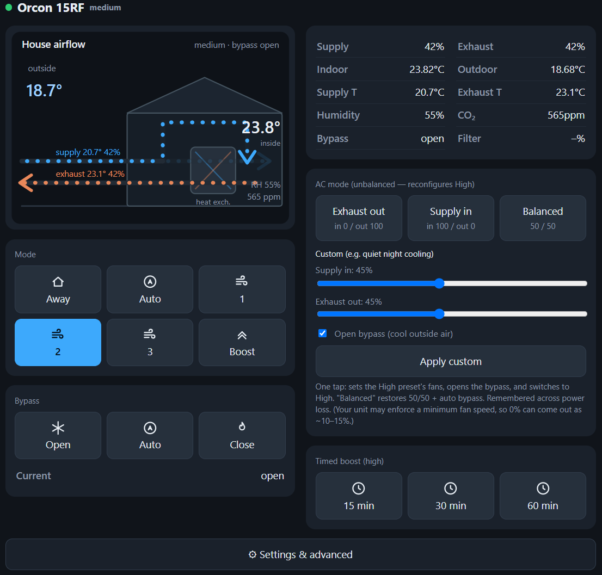
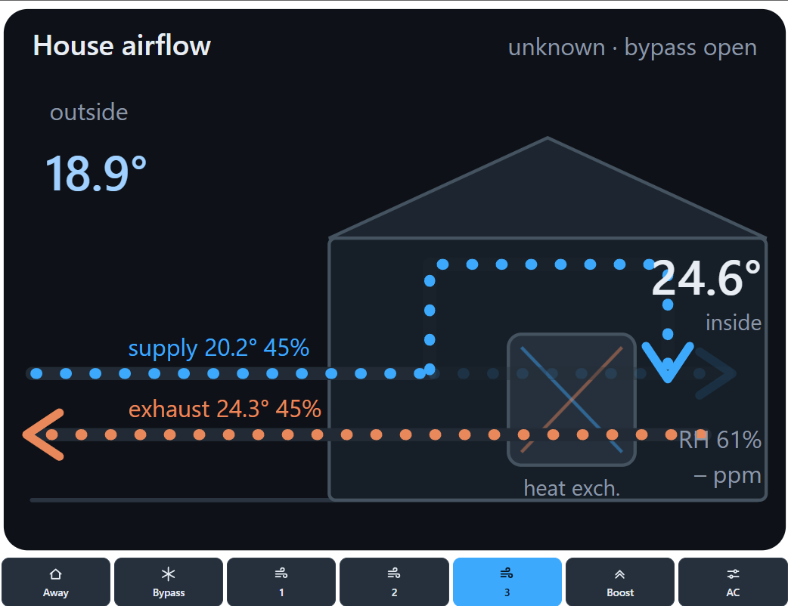

# Orcon 15RF controller (ESP32 + RAMSES-II)

Wi-Fi / MQTT / touch-screen controller for **Orcon HRC** heat-recovery ventilation
units (HRC300 / **HRC400** / MVS-15R and relatives). It emulates the **Orcon 15RF**
CO₂/RH wall controller over 868.3 MHz **RAMSES-II**, so you can set fan modes,
timed boost, the summer **bypass**, and an unbalanced **AC / night-cooling** mode
from a web page, MQTT/Home Assistant, or an on-device touch display — while the
unit's own safety logic stays untouched (everything goes over the RF control
path, not the motor).

> Unofficial and reverse-engineered from community work. Not affiliated with
> Orcon. See [`CREDITS.md`](CREDITS.md). MIT licensed — see [`LICENSE`](LICENSE).

> ⚠️ **Work in progress.** This controls a real HRC400 reliably today, but it's an
> active project with rough edges — the on-screen 480×480 touch UI isn't polished
> yet, and the SX1276 build is freshly brought up. See
> [Project status](#project-status) before relying on it.

---

## What it does

- **Modes**: `Away / Auto / 1 / 2 / 3 / Boost` (`22F1`) and timed boost
  `15 / 30 / 60 min` (`22F3`).
- **Bypass**: open / auto / close (`22F7`) — force the heat-exchanger bypass for
  night cooling.
- **AC mode**: one-tap unbalanced supply/exhaust (reconfigures the High preset via
  `2411`) for quiet cooling, e.g. exhaust > supply to pull warm air out.
- **Live status**: decodes the unit's broadcasts (`31DA` extended status, `31D9`
  mode, `12A0` humidity, `1298` CO₂, `10D0` filter, `042F` power-cycle) into a
  live model — temps, RH, CO₂, supply/exhaust %, bypass, filter, faults.
- **Deliberate pairing**: mimics the real 15RF "Auto+1" bind (`1FC9`) — power-cycle
  the HRC, tap **Pair**, and it learns the fan's ID from the handshake. Each unit
  auto-generates a unique controller ID on first boot.
- **Interfaces**: onboard web UI, MQTT (with Home Assistant auto-discovery), an
  embeddable airflow widget, and — on the Guition panel — an on-screen touch UI.

## Screenshots

| Web control page | Airflow widget | Touch display *(WIP)* |
|:---:|:---:|:---:|
|  |  | _📷 coming soon_ |

## Radio options (important)

RAMSES-II is 2-FSK, 38.4 kbps, Manchester-framed. The chip must expose the raw
demodulated bitstream (transparent / continuous mode); we feed it through a UART
and decode in software (the evofw3 method). **Not every LoRa chip can do this:**

| Radio | Works? | Notes |
|-------|--------|-------|
| **CC1101** | ✅ **Recommended** | The community standard. RX **and** TX via async serial. ~€2 external module. |
| **SX1276 / SX1279** (SX127x) | ✅ | Has direct/continuous mode → same trick on the *on-board* radio (e.g. Heltec WiFi LoRa 32 **V2**). SX1278 is 433 MHz — not 868. |
| SX1262 / SX1268 (SX126x) | ❌ | No transparent mode. Packet engine can't frame RAMSES. Kept only as an experiment. |
| SX1302/1303 | ❌ | LoRaWAN gateway concentrators, wrong class of chip. |

For a clean build, use **CC1101** (any USB-C ESP32-S3 + a CC1101 module) or an
SX1276 board. See [`docs/PROTOCOL.md`](docs/PROTOCOL.md) for the SX1276 direct-mode
write-up.

## Help wanted: SX1262 single-board RX 🆘

The nicest outcome would be a **single-board build on the Heltec V3/V4** (ESP32-S3 +
SX1262, USB-C) with **no external CC1101** — but receive doesn't work. Here's exactly
what we tried and why it fails, in case someone in the community has cracked it.

**The core problem:** the SX126x family has **no transparent / continuous / direct
FSK mode**. On the CC1101 and SX127x you can stream the raw demodulated bitstream out
a GPIO into a UART and decode RAMSES in software (that's how this project works).
The SX1262 can't do that — everything must go through its packet engine.

**What works — TX.** We build the whole on-air frame (preamble + sync + Manchester
payload) in firmware and transmit it as a raw fixed-length GFSK packet; the radio
just modulates our bits. The fan obeys.

**What fails — RX.** We tried:

- `beginFSK(868.3, 38.4, 50.78, rxBw)`, NRZ encoding, CRC **off**, whitening **off**
- sync word set to a slice of the RAMSES preamble/sync (`55 53`), a fixed-length
  receive window, then software de-frame + Manchester decode
- `setDio2AsRfSwitch(true)` + `setTCXO(1.6)` — **mandatory** on Heltec: the antenna is
  routed through an RF switch on DIO2, so without this the radio is electrically deaf

Result: **RSSI reads correctly** (antenna path is fine), but the packet engine
**never declares a valid RAMSES packet** — `rx_n` stays 0. RAMSES is variable-length,
Manchester-coded, with framing the SX1262's engine can't match (no length byte where
it expects one), and there's no raw-bit mode to bypass the engine and decode in
software the way we do on the CC1101.

**Ideas welcome — please [open an issue or discussion](../../issues).** Things we
haven't fully explored: continuous RX into a large fixed-length buffer with sync
detection done in software; alternative sync-word / preamble slicing; reading the
FIFO mid-packet; or any register-level trick to expose raw data on a DIO. Even a
definitive *"no, it's genuinely impossible on SX126x because X"* would be useful.

Until then, **CC1101** (external) or **SX1276** (on-board) are the working paths.

## Supported boards / build envs

Defined in `platformio.ini`:

| Env | Board | Radio |
|-----|-------|-------|
| `heltec_v3_cc1101_ota` *(default)* | Heltec WiFi LoRa 32 V3/V4 (ESP32-S3) | external CC1101, RX+TX |
| `heltec_v2_sx1276` | Heltec WiFi LoRa 32 **V2** (ESP32) | on-board SX1276, RX+TX |
| `esp32-480480s040` | Guition ESP32-4848S040 (480×480 touch) | CC1101 on shared SPI |
| `heltec_v3_1262_ota` | Heltec V3/V4 | on-board SX1262 (experimental) |
| `native` | host | unit tests (no hardware) |

## Build & flash

1. Install [PlatformIO](https://platformio.org/) (`pip install platformio`).
2. First flash over USB (later updates go over Wi-Fi / OTA):
   ```bash
   pio run -e heltec_v3_cc1101_ota -t upload --upload-port COM5
   pio device monitor
   ```
3. On first boot with no Wi-Fi set, it starts a setup portal (`Orcon15RF-Setup` /
   `orconsetup` → http://192.168.4.1). Enter your Wi-Fi (and optional MQTT host).
4. Open the device's web UI at its IP. **Pair**: power-cycle your HRC, then tap
   *Pair with my Orcon* within 3 minutes.

Wiring for each board's radio is in `src/config.h` (per-board pin blocks).

## Controls & MQTT

The web UI keeps daily controls up front (modes, timed boost, live metrics,
bypass, AC mode, pairing) and tucks diagnostics behind a ⚙ Settings toggle.

| Topic | Dir | Payload |
|-------|-----|---------|
| `orcon15rf/state` | out (retained) | JSON: mode, supply/exhaust %, temps, humidity, co2, bypass, filter, fault, fan_id, rssi, pairing status |
| `orcon15rf/cmd` | in | `{"mode":"high"}`, `{"timer":30}`, `{"bypass":"open"}`, `{"ac_mode":"exhaust"}`, `{"ac_sup":20,"ac_exh":40,"ac_byp":1}`, `{"pair":1}` |

Home Assistant auto-discovery is published on connect (also works with Domoticz).

## Airflow widget

A self-contained page at **`/widget.html`** shows an animated house — supply air
routed **through** the heat-exchanger core (bypass closed) or **around** it
(bypass open) — with live temps/RH/CO₂ and a row of quick buttons
(Away · Bypass · 1 · 2 · 3 · Boost · AC). Embed it in a dashboard:

```html
<iframe src="http://orcon15rf.local/widget.html" style="width:320px;height:420px;border:0"></iframe>
```

## On-screen UI (Guition 4848S040)

The `esp32-480480s040` build adds a 480×480 touch UI: swipeable pages (control,
custom AC, airflow, system), a bypass/mode grid, and an idle **airflow
screensaver** (tap to wake to the controls).

## Settings keeper (survive Orcon power loss)

The HRC forgets custom fan-speed settings on mains loss. Every fan-speed / bypass
you set is remembered in flash; with **Auto-restore** on, the ESP re-pushes them
~20 s after it sees the fan power-cycle (`042F`). MQTT: `{"autorestore":1}`,
`{"reapply":1}`, `{"forget":1}`.

## Diagnostics

- `/log` — rolling RX/TX log in `ramses_rf` string form (RX green, TX amber, with
  RSSI), plus device-ID / manual-clone controls.
- `/debug` — link counters and **byte rulers** for every status frame, for dialling
  in `31DA` offsets against a real unit.
- `/update` — browser firmware upload (no CLI).
- `pintest_4848` env — GPIO mapper for verifying CC1101 wiring on the Guition board.

## Tests

The protocol layer is plain C++ and host-tested before it touches hardware:

```bash
cd test
g++ -std=c++17 -I../src test_codec.cpp  ../src/ramses_codec.cpp                          -o test_codec  && ./test_codec
g++ -std=c++17 -I../src test_frames.cpp ../src/ramses_codec.cpp ../src/orcon_frames.cpp  -o test_frames && ./test_frames
```

## Project status

**Works today:**
- CC1101 RX+TX (Heltec + Guition), SX1276 RX+TX (Heltec V2)
- Full control of a real HRC400 — modes, timed boost, bypass, AC mode
- Web UI, MQTT + Home Assistant discovery, deliberate pairing
- `31DA` decoding calibrated against a real unit

**Work in progress / rough edges:**
- 🚧 The **480×480 touch UI** (Guition 4848S040) is functional but **not visually
  polished** — spacing/layout and the airflow page still need design work.
- 🚧 The **SX1276 single-board** build is freshly brought up; FSK bandwidth/
  deviation may need per-environment tuning.
- 🚧 **Multi-day durability** soak is ongoing.
- ⚠️ `31DA` byte offsets and some tail bytes are calibrated to one HRC400; other
  HRC/MVS models may differ — the `/debug` byte rulers make these easy to re-check.

Reverse-engineered, unofficial, no warranty. See [`CREDITS.md`](CREDITS.md).

Full protocol write-up: [`docs/PROTOCOL.md`](docs/PROTOCOL.md).
